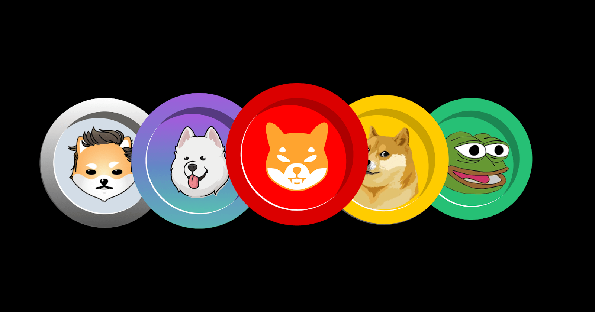

# Other Assets

## XGM - XGame Utility Token

$XGM is a digital asset specifically created for the XGame platform, built on blockchain technology to enable secure ownership, transfer, and trade of game assets.

### Token Metrics
- **Total Supply**: 100 Billion XGM
- **Value**: $0.00
- **Market Cap**: $0.00
- **Yearly Inflation**: 0%
- **Decimal**: 12
- **Existential Deposit**: 0.01 XGM

### Distribution
- **Investors**: 20 Billion XGM
- **Play-to-earn**: 60 Billion XGM
- **Development**: 10 Billion XGM
- **Community Engagement**: 15 Billion XGM
- **Reserve**: 5 Billion XGM

### Treasury Management
Managed through Xode OpenGov and Humidefi Liquidity Pool

### Investor Relations
$XGM will be offered through launchpads like Polimec. The bulk of tokens will support play-to-earn models across all games in the XGame platform.

### External Auditor
Certik

### XGame Platform
XGame is an immersive gaming platform that combines traditional gaming with Web3 elements. Players can earn real rewards and digital assets that become tangible value outside the game environment.

#### Play, Earn, Monetize!
Players immerse themselves in thrilling adventures, quests, and epic battles while earning digital assets and NFTs. These rewards can be transferred, sold, or traded outside the XGame environment, converting fantasy world earnings into real fiat currency.

#### Multiple Tokens
While $XON serves as the native digital currency, $XGM is the primary exchange token within XGame, enabling seamless buying, selling, and trading of in-game assets.

Having separate tokens per game offers unique economies tailored to specific game mechanics, challenges, and rewards, providing clarity and transparency for in-game asset values.

---

## XAV - Xaver Utility Token

$XAV is a digital asset created for the Xaver platform, a distributed lite client Xode node designed for enterprises wishing to interact with the blockchain locally.

### Token Metrics
- **Total Supply**: 100 Billion XAV
- **Value**: $0.00
- **Market Cap**: $0.00
- **Yearly Inflation**: 0%
- **Decimal**: 12
- **Existential Deposit**: 0.01 XAV

### Distribution
- **Investors**: 20 Billion XAV
- **Hardware**: 60 Billion XAV
- **Development**: 10 Billion XAV
- **Community Engagement**: 15 Billion XAV
- **Reserve**: 5 Billion XAV

### Treasury Management
Managed through Xode OpenGov and Humidefi Liquidity Pool

### Investor Relations
$XAV will be offered through launchpads like Polimec, with the bulk of tokens used for airdrops to all lite node clients in the Xaver platform.

### External Auditor
Certik

---

### Lite Node Technology
Most blockchain user interfaces connect to centralized servers (like PolkadotJS), creating single points of failure. While full nodes provide trustless interaction, they require substantial knowledge and resources.

Lite nodes connect to the peer-to-peer network and interact with multiple full nodes without requiring continuous operation or extensive storage. They rely on full nodes for information retrieval while maintaining security.

### Use Cases
- **Governance**: $XAV holders can participate in protocol upgrades and parameter changes through on-chain voting
- **Staking**: Validators and nominators stake $XAV for block production and validation
- **Transaction Fees**: $XAV is used to pay transaction fees on the Xaver network

### Sample Reward Computation
- Total staked XAV: 10,000,000 XAV
- Total reward pool: 1,000 XAV (per era)
- Number of nodes: 1,000
- Node blocks produced: 10
- Total blocks in era: 1,000

**Calculation**:
- Block production rewards: (10/1,000) × 1,000 XAV = 10 XAV
- Block verification rewards: 1,000 XAV ÷ 1,000 = 1 XAV
- **Total reward**: 10 XAV + 1 XAV = 11 XAV

---

## AZK - Azkal Meme Token

$AZK is Xode's meme token, similar to Dogecoin and Shiba Inu, used for tipping content creators, supporting charitable causes, and as a form of payment.

### Token Metrics
- **Total Supply**: 100 Trillion AZK
- **Value**: $0.00
- **Market Cap**: $0.00
- **Yearly Inflation**: 0%
- **Decimal**: 12
- **Existential Deposit**: 0.01 AZK

### Distribution
- **Investors**: 60 Trillion AZK
- **Airdrop**: 10 Trillion AZK
- **Development**: 10 Trillion AZK
- **Community Engagement**: 10 Trillion AZK
- **Reserve**: 10 Trillion AZK

### Treasury Management
Managed through Xode OpenGov and Humidefi Liquidity Pool

### Investor Relations
$AZK will be offered through launchpads like Polimec and random airdrops to all Xode wallet holders.

### External Auditor
Certik

---

### Meme Token Characteristics
Meme tokens are typically created for entertainment based on internet memes rather than serious investment purposes. They often feature humorous themes and may lack fundamental utility but can gain popularity through viral nature and community enthusiasm.

Meme tokens can gain popularity and traction based on their novelty or viral nature, leading to speculative trading and rapid price movements. However, they are generally considered highly risky and volatile investments, as they may lack any real value or utility beyond their entertainment factor. Examples of meme tokens include Dogecoin, Shiba Inu, and many others that have emerged in the cryptocurrency space.
s
### Community Popularity
Meme Coins has gained significant popularity and has been used for tipping content creators online, supporting charitable causes, and even as a form of payment in some places. It has also experienced periods of speculative trading, leading to fluctuations in its price. While Meme Coin may not have the same level of serious development and utility as some other cryptocurrencies, its enthusiastic community and unique culture have helped it maintain a presence in the crypto space for many years.

### Tokenomics
Sale/Pre-sale Mechanics

---

## IXON - Private XON Token

$IXON serves early investors as a temporary asset that can be swapped 1:1 for XON, the native token of Xode Blockchain. It includes vesting periods, lockups, and compliance mechanisms to ensure alignment with long-term project goals.

### Token Metrics
- **Total Supply**: 1.2 Billion IXON
- **Value**: $0.00
- **Market Cap**: $0.00
- **Yearly Inflation**: 0%
- **Decimal**: 12
- **Existential Deposit**: 0.01 XON

### Distribution

#### IXON Lockup - 70% (857 Million IXON)
- **Burn Schedule**: Annually, 10% of locked coins burned over 8 years

#### Staking Rewards - 10% (120 Million IXON)
- **Annual Reward Rate**: 4%

#### Allocation of Remaining - 20% (244 Million IXON)
- **Private Sale**: 5% (61 Million IXON)
- **Exchange Liquidity Provision**: 5% (61 Million IXON)
- **Developers**: 2% (24 Million IXON)
- **Marketing**: 2% (24 Million IXON)
- **Partnerships**: 2% (24 Million IXON)
- **Reserve Fund**: 2% (24 Million IXON)
- **Founders**: 2% (24 Million IXON)

### Important Note
IXON is only used for Private Sale, with only 61 Million IXON released and swappable with XON. Upon achieving specific milestones (like mainnet launch), the private token is burned in exchange for the native token, preserving supply integrity.

