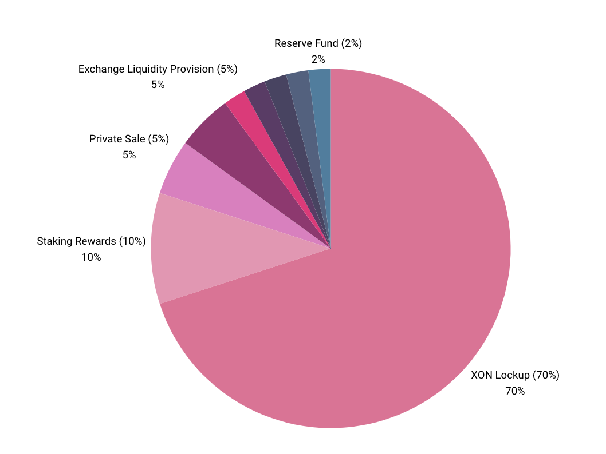

# XON Tokenomics

XON is used as a medium of exchange for transactions within the XODE Blockchain and also serves to incentivize network participants, pay transaction and computation fees, and facilitate smart-contract execution.

## Total Supply and Initial Price

- **Total Supply**: 1,224,937,488.2724 XON (~1.225 billion)
- **API Endpoints**:
  - Total Supply: `https://wallet-api.xode.net/chain/totalsupply`
  - Total Circulating Supply: `https://wallet-api.xode.net/chain/circulatingsupply`

## Coin Distribution

### XON Lockup — 70%
- **Locked Coins**: 857,456,241.79068 XON (~857 million)
- **Management**: Xode Foundation (DAO)
- **Staking Structure**: Locked coins are held within the Xode Foundation (DAO)
- **Burn Schedule**:
  - Annually, 10% of the locked coins will be burned over 8 years.
  - Schedule can be adjusted via governance to respond to market conditions.

### Staking Rewards — 10%
- **Coin Quantity**: 122,493,748.82724 XON (~120 million)
- **Annual Reward Rate**: 4%
- **Purpose**: Enhance network stability and security through staking participation.

### Allocation of Remaining — 20% (244,987,497.65448 XON)

- **Private Sale (5%)**
  - 61,246,895.41362 XON
  - Purpose: Raise initial capital and involve strategic partners

- **Exchange Liquidity Provision (5%)**
  - 61,246,895.41362 XON
  - Purpose: Ensure liquidity for smooth trading on exchanges

- **Team and Developer Compensation (2%)**
  - 24,498,749.765448 XON
  - Purpose: Reward contributors for ongoing development and maintenance

- **Marketing and Community Development (2%)**
  - 24,498,749.765448 XON
  - Purpose: Drive marketing initiatives and foster community growth

- **Partnerships and Ecosystem Expansion (2%)**
  - 24,498,749.765448 XON
  - Purpose: Build strategic partnerships and expand the ecosystem

- **Reserve Fund (2%)**
  - 24,498,749.765448 XON
  - Purpose: Buffer for unforeseen circumstances and long-term stability

- **Founders (2%)**
  - 24,498,749.765448 XON
  - Purpose: Reward founders for vision and leadership

## Governance and Flexibility

The Xode Foundation (DAO) manages locked coins and oversees the burn schedule. The community can dynamically adjust the burn cadence through governance to maintain a flexible and responsive coin economy. This decentralized approach aims to align incentives and safeguard the long-term health of the XODE ecosystem.

## Conclusion

XODE’s tokenomics emphasize long-term value creation, stability, and community empowerment. A significant lockup with a governance-managed burn, coupled with strategic allocations for liquidity, development, marketing, partnerships, and reserves, provides a balanced and robust foundation for sustainable growth. Stakeholders are invited to help build a decentralized, resilient, and thriving XODE ecosystem.
