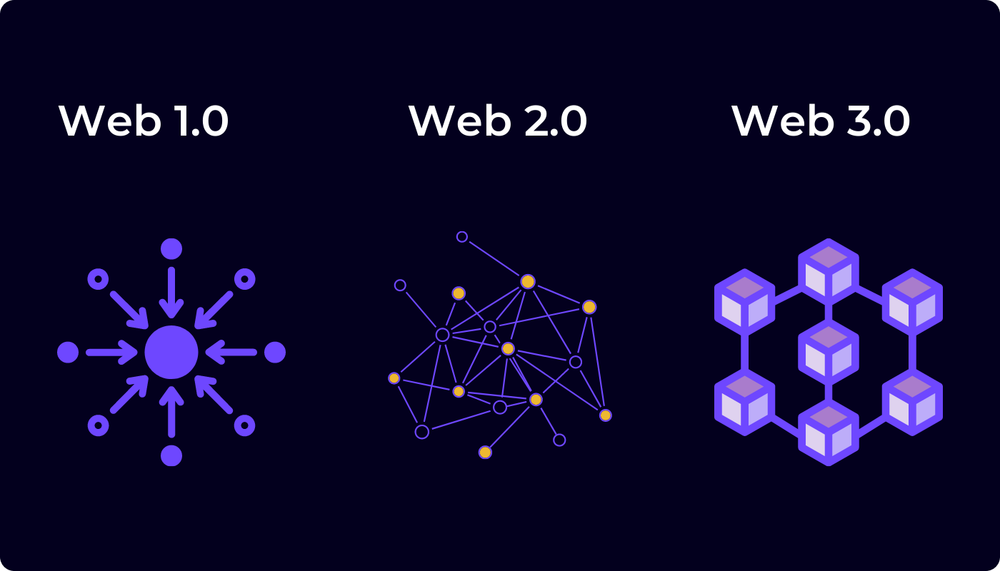

# Understanding Web3

*Created by Hgminerva*  
*Last updated: May 15, 2024 • 4 min read*

Web3 is a term that refers to the vision of a decentralized and user-centric internet, built on blockchain technology and cryptographic principles. It represents a paradigm shift from the current web (Web 2.0), which is dominated by centralized entities like social media platforms, search engines, and online marketplaces.

In Web3, the control over data and digital assets is shifted from centralized authorities to individuals. Blockchain technology, the underlying technology behind cryptocurrencies like Bitcoin, Ethereum, Polkadot and XODE, plays a central role in enabling this decentralization. Smart contracts, which are self-executing contracts with the terms of the agreement directly written into code, facilitate automated transactions and interactions without the need for intermediaries.

Key concepts and technologies associated with Web3 include decentralized finance (DeFi), non-fungible tokens (NFTs), decentralized autonomous organizations (DAOs), decentralized applications (DApps), and more. The aim of Web3 is to create a more transparent, secure, and inclusive internet that empowers users and fosters innovation.

## Trust and Truth

### Trustlessness

Web3 platforms aim to minimize the need for trust between parties by relying on cryptographic principles and decentralized consensus mechanisms. In traditional systems, trust is often placed in centralized authorities like banks or governments to facilitate transactions and verify information. However, in Web3, trust is minimized or eliminated through the use of technologies such as blockchain, where transactions are recorded in a transparent and immutable manner, and smart contracts, which automatically execute agreements without the need for intermediaries. This trustlessness ensures that participants can interact with each other directly, without having to rely on trusted third parties.

### Truthfulness

In Web3, truthfulness refers to the accuracy and integrity of information stored on the blockchain. Because data on a blockchain is immutable and tamper-proof, once recorded, it cannot be altered or deleted. This characteristic ensures that the information stored on the blockchain is considered truthful and reliable. Additionally, consensus mechanisms such as proof of stake (PoS) or proof of work (PoW) ensure that all participants in the network agree on the validity of transactions and the state of the blockchain, further reinforcing the truthfulness of the data.

## Evolution

The evolution of the web can be understood through three distinct phases, each representing a fundamental shift in how we interact with and control digital information and services.

### Web1 (1990s - early 2000s)

Web1, often referred to as the "read-only" web, emerged in the early days of the internet. It was characterized by static web pages primarily containing text and basic HTML formatting.

- Websites were primarily informational, and user interaction was limited to browsing content
- Examples include early websites like Yahoo!, GeoCities, and the first versions of search engines like Altavista and Lycos
- The focus was on making information accessible and building the infrastructure for the World Wide Web

### Web2 (Mid-2000s - Present)

Web2, often termed the "read-write" web, marked a shift towards dynamic, interactive, and user-generated content.

- Social media platforms like Facebook, Twitter, and YouTube gained prominence, enabling users to create and share content, connect with others, and participate in online communities
- Web2 introduced concepts like user-generated content, social networking, blogging, and e-commerce
- Companies like Google, Amazon, and eBay dominated the online landscape, offering services ranging from search and advertising to online marketplaces and cloud computing
- The emphasis was on user engagement, collaboration, and monetization through advertising and data collection

### Web3 (Emerging - Present)

Web3 represents a vision for a decentralized, user-centric internet built on blockchain technology and cryptographic principles.

- It aims to address issues of data privacy, security, and control by shifting power away from centralized authorities towards individuals
- Key technologies associated with Web3 include blockchain, smart contracts, decentralized finance (DeFi), non-fungible tokens (NFTs), decentralized autonomous organizations (DAOs), and decentralized applications (DApps)
- Web3 promotes trustlessness, transparency, and inclusivity, enabling peer-to-peer transactions, automated agreements, and secure data sharing without the need for intermediaries
- Platforms like Ethereum, Polkadot, XODE and others are at the forefront of building the infrastructure for Web3, enabling developers to create decentralized applications and services that operate independently of central control

Web3 is still in its early stages of development, but it holds the promise of revolutionizing various industries, including finance, gaming, supply chain management, and more, by providing new models of ownership, governance, and value exchange.

## Key Web3 Technologies

### Blockchain
The foundational technology that enables decentralized, immutable record-keeping and consensus mechanisms.

### Smart Contracts
Self-executing contracts with predefined rules and conditions, enabling automated transactions and agreements.

### Decentralized Finance (DeFi)
Financial services built on blockchain technology, including lending, borrowing, trading, and yield farming.

### Non-Fungible Tokens (NFTs)
Unique digital assets that represent ownership of digital or physical items, enabling new forms of digital ownership and value.

### Decentralized Autonomous Organizations (DAOs)
Organizations governed by smart contracts and community voting, enabling decentralized decision-making and governance.

### Decentralized Applications (DApps)
Applications that run on blockchain networks, providing services without centralized control or intermediaries.

## Web3 and Xode

Xode is built on Web3 principles and technologies, providing developers with the tools and infrastructure needed to build the next generation of decentralized applications. By leveraging blockchain technology, smart contracts, and decentralized protocols, Xode enables the creation of applications that are:

- **Trustless**: No need to trust centralized authorities
- **Transparent**: All transactions and data are publicly verifiable
- **Censorship-resistant**: Applications cannot be shut down by single points of failure
- **User-controlled**: Users maintain ownership and control over their data and assets

Through Xode's platform, developers can harness the power of Web3 to create innovative solutions that address real-world challenges while maintaining the core principles of decentralization and user sovereignty.
