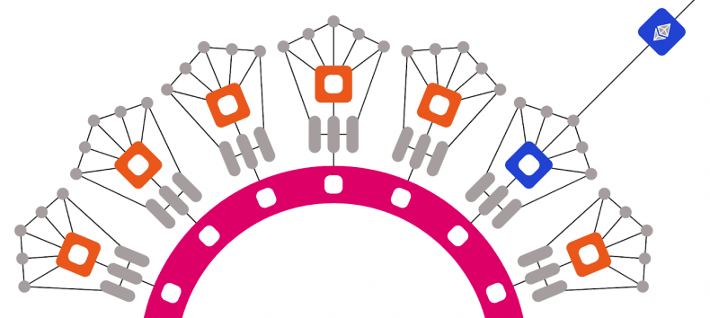

# Polkadot Ecosystem

*Created by Hgminerva*  
*Last updated: May 15, 2024 • 4 min read*

The Polkadot ecosystem is the network of projects, protocols, developers, users, and stakeholders that contribute to and utilize the Polkadot blockchain platform and its associated technologies. Polkadot, created by the Web3 Foundation, is a blockchain interoperability protocol designed to enable different blockchains to connect and communicate with each other in a secure and scalable manner.

## Key Components of the Polkadot Ecosystem

### Polkadot Network

At the core of the ecosystem is the Polkadot network itself, which consists of a relay chain and parachains. The relay chain serves as the main blockchain, while parachains are independent blockchains that connect to the relay chain.

### Parachains

Parachains are sovereign blockchains that run in parallel to the Polkadot relay chain. They can have their own consensus mechanisms, governance structures, and token economies. Parachains connect to the relay chain via bridges called parachain slots, allowing them to benefit from the security and interoperability features of the Polkadot network.

### Substrate Framework

Substrate is a blockchain development framework created by Parity Technologies, which allows developers to build custom blockchains and parachains that are compatible with the Polkadot ecosystem. Substrate provides a modular and customizable architecture, making it easier for developers to create blockchain projects tailored to their specific needs.

## The Relay Chains

The Polkadot Relay Chain and the Kusama Relay Chain are the main components of their respective blockchain networks, serving as the backbone for the Polkadot and Kusama ecosystems. Both relay chains share a similar design and purpose, but they serve different roles within their respective networks.

### Polkadot Relay Chain

- **Main Blockchain**: The Polkadot Relay Chain is the main blockchain of the Polkadot network.
- **Hub Function**: It serves as a hub for connecting and coordinating communication between different parachains.
- **Security**: The Relay Chain is responsible for maintaining the shared security of the entire network, ensuring consensus among validators, and facilitating cross-chain interoperability.
- **Consensus**: Polkadot's Relay Chain employs a nominated proof-of-stake (NPoS) consensus mechanism, where token holders can nominate validators to secure the network and earn rewards.
- **Governance**: The Relay Chain is governed by on-chain governance mechanisms, allowing token holders to participate in decision-making processes for protocol upgrades, parameter adjustments, and the addition of new parachains.

### Kusama Relay Chain

- **Canary Network**: The Kusama Relay Chain is often referred to as Polkadot's canary network or its experimental cousin.
- **Experimental Platform**: Kusama is a network designed for early-stage experimentation and innovation, allowing developers to test new features, protocols, and upgrades before they are deployed on Polkadot.
- **Similar Functionality**: The Kusama Relay Chain serves a similar role to the Polkadot Relay Chain, facilitating communication between parachains and coordinating consensus among validators.
- **Dynamic Governance**: However, Kusama has a more dynamic governance model and a faster iteration cycle compared to Polkadot, making it more suitable for risk-taking and rapid innovation.
- **Agile Process**: Kusama's governance process is designed to be more experimental and agile, allowing changes and upgrades to be implemented more quickly based on community feedback and consensus.

## Parachains

Parachains are sovereign, independent blockchains that run in parallel within the Polkadot network. They are one of the key components of the Polkadot ecosystem, designed to enable scalability, interoperability, and customizability. Here are some key characteristics and functionalities of parachains:

### Independent Blockchains

Parachains operate as independent blockchains with their own consensus mechanisms, governance structures, and token economies. They can have their own native tokens and execute smart contracts or decentralized applications (DApps) specific to their use case.

### Connectivity to the Relay Chain

Parachains connect to the Polkadot Relay Chain, the main blockchain of the Polkadot network, through a mechanism called "collators." Collators collect transactions from their respective parachains, produce proofs of validity, and submit them to the Relay Chain for finalization.

### Shared Security

Parachains benefit from the shared security of the Polkadot network. Instead of maintaining their own security through individual validators, parachains rely on the security provided by the validators of the Relay Chain. This shared security model enhances the overall security of the network and reduces the overhead for parachain developers.

### Interoperability

Parachains can communicate and transact with each other through the Relay Chain, enabling cross-chain interoperability. This allows for the seamless exchange of assets, data, and messages between different parachains within the Polkadot ecosystem.

### Scalability

By running in parallel to each other, parachains increase the overall scalability of the Polkadot network. Each parachain can process transactions and execute smart contracts independently, enabling higher throughput and reducing congestion on the network.

### Governance and Upgrades

Parachains have their own governance mechanisms, allowing token holders to participate in decision-making processes for protocol upgrades, parameter adjustments, and the addition of new features. This ensures that parachain communities have autonomy and control over the evolution of their respective blockchains.

## Conclusion

Parachains play a crucial role in the Polkadot ecosystem by enabling a diverse range of blockchain projects to coexist, interact, and collaborate within a single network. They offer flexibility, scalability, and interoperability, making Polkadot a powerful platform for building decentralized applications and next-generation blockchain solutions.
