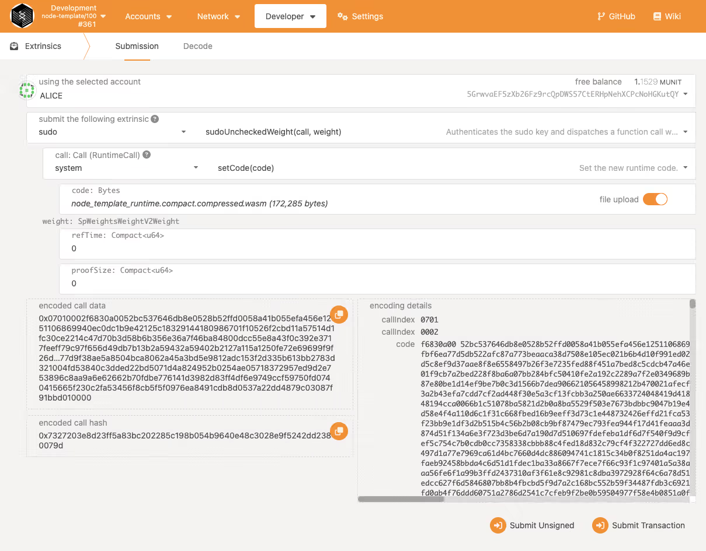
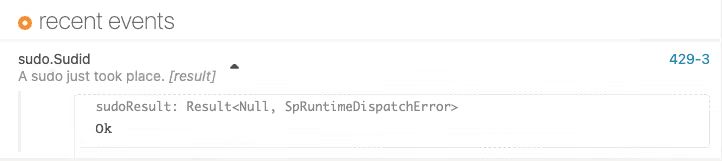

# XODE Governance

*Created by Hgminerva*  
*Last updated: 1 month ago • 6 min read*

Xode Governance is an innovative governance framework that merges the strengths of the Xode Foundation, a decentralized autonomous organization (DAO) foundation based in Panama, with the cutting-edge on-chain OpenGov governance model of Polkadot. This hybrid approach combines the decentralized, community-driven principles of the Xode Foundation with Polkadot's transparent, adaptive, and inclusive on-chain decision-making processes. By leveraging these synergies, Xode Governance aims to foster a robust and participatory ecosystem, empowering stakeholders to collaboratively shape the future of decentralized technologies and ensure sustainable development across the blockchain landscape.

## Xode Foundation

The XODE Foundation, established by the creators of XODE, has the primary purpose of promoting and nurturing the development of decentralized web technologies. The foundation aims to accelerate the development and adoption of a decentralized web, where users have more control over their data and digital interactions.

### Foundation Objectives

- **Funding and Support**: Provide grants and funding to projects that build on or support the XODE ecosystem and other Web3 technologies. This includes startups, developers, and researchers.
- **Research and Development**: Conduct and sponsor research into decentralized protocols, cryptographic methods, and blockchain technology to advance the development of the Xode ecosystem.
- **Community Building**: Foster a global community of developers, researchers, and enthusiasts to collaborate on building the decentralized web. This involves organizing events, conferences, and hackathons.
- **Education and Advocacy**: Promote the understanding and adoption of decentralized technologies by producing educational content, documentation, and outreach programs.
- **Governance and Standards**: Develop and promote best practices, standards, and governance models for decentralized technologies to ensure they are secure, scalable, and interoperable.

## Decentralized Autonomous Organization (DAO)

Xode DAO operates as a decentralized autonomous organization anchored by a Panama-based foundation, which serves as its governing entity. This foundation provides a legal and regulatory framework to oversee the operations and governance of the Xode Token, ensuring transparency, compliance, and accountability. By combining the decentralized nature of blockchain with the structure of a traditional foundation, Xode DAO enables token holders to actively participate in decision-making processes, while the foundation acts as a neutral custodian for legal matters and off-chain assets. This hybrid model strengthens the DAO's ability to operate efficiently and sustainably, bridging the gap between decentralized technology and global regulatory standards.

### Business Operations

- **Constitution**: The Constitution of the Panama Foundation will be drafted to provide the legal framework and governance structure.
- **Council Members**: Letters of Appointment will be prepared to formalize the roles and responsibilities of the two councils—the Treasury Council, responsible for overseeing financial and resource management, and the Technical Committee, tasked with guiding technical development and innovation.
- **Business Operations**:
  - Consulting/Employment/Agreements Core Team Contributors and the between XODE Foundation
  - Platform Terms & Conditions including IP rights and disclaimers
  - Investment Agreements
  - Terms of the Service Agreement between existing Philippines technology company (ROCKSON TECH) and XODE Foundation

These steps are crucial to ensure a robust and compliant foundation for the DAO's operations.

## OpenGov

Polkadot's OpenGov is a governance framework designed to enhance the decentralized decision-making process within the XODE Blockchain. It aims to provide a more inclusive, transparent, and efficient way for the community to participate in the governance of the network.

### Key Features

- **Enhanced Participation**: OpenGov introduces mechanisms that allow a broader range of stakeholders to participate in governance decisions, including changes to the network protocol and allocation of resources.
- **Dynamic Referenda**: The framework enables more flexible and adaptive referenda, allowing the community to propose, discuss, and vote on changes and upgrades more effectively.
- **Proposals and Voting**: OpenGov facilitates the submission of governance proposals and the voting process, ensuring that all stakeholders have a say in the evolution of the network.
- **Transparency and Accountability**: It aims to increase transparency in governance processes and hold participants accountable, ensuring that decisions are made in the best interest of the network.
- **Adaptability**: The system is designed to be adaptable, allowing for modifications and improvements based on community feedback and evolving needs.

OpenGov is part of Polkadot's broader vision of decentralized governance, aiming to create a more democratic and responsive ecosystem for its users. For more information about Polkadot's OpenGov: [https://support.polkadot.network/support/solutions/65000105211](https://support.polkadot.network/support/solutions/65000105211)

## XODE Blockchain Governance Roadmap

The Xode Blockchain Governance roadmap is designed to evolve progressively, ensuring that the system becomes increasingly decentralized and adaptable to the needs of the community.

### 2025 Q1 - Basic (Collectives, Membership)

In the first phase, we focus on establishing the foundational governance structure. This includes the creation of collectives and the implementation of a membership system, allowing stakeholders to participate in the governance process. These components will set the groundwork for community-driven decision-making and enable users to engage with the blockchain through a transparent and accessible framework.

### 2025 Q3 - Governance v1 (Democracy, Reference, Conviction-Voting, Preimage, Scheduler, etc.)

The next phase will introduce Governance v1, incorporating key features like democracy-based voting mechanisms, reference management, and conviction voting to enhance decision-making. Preimage support will enable better proposal tracking, while a scheduler system will ensure efficient execution of governance decisions. This phase aims to solidify the governance model, giving stakeholders greater control and the ability to influence protocol upgrades and changes.

### 2025 Q4 - Governance v2/OpenGov

As we move towards the future, Xode will adopt Governance v2/OpenGov, a more sophisticated and flexible model for governance. OpenGov will introduce enhanced transparency and a more dynamic structure, allowing for community-driven proposals and decentralized execution of decisions. This phase will incorporate more advanced features, such as DAO-style voting systems, on-chain identity management, and increased modularity, enabling a truly decentralized governance framework.

This roadmap will be updated quarterly to reflect the progress and milestones achieved, with community input shaping the ongoing development of Xode Blockchain Governance.

## XODE Blockchain v0.1.0 (RuntimeUpgrade) Implementation

Zeeve is a key provider of collator bootnode infrastructure for the XODE Blockchain, serving both the Testnet and Mainnet environments. As part of our ongoing commitment to maintaining and enhancing the XODE network, we are planning an important upgrade to the runtime for both environments. The upgrade for the Testnet is scheduled for September 2024, followed by the Mainnet upgrade in January 2025. These upgrades are designed to improve performance, security, and functionality, ensuring the continued stability and advancement of the XODE Blockchain.

## Upgrade Process

**NOTE**: What most teams do is a two-step process - upgrade to a runtime with both sudo and democracy pallets, make sure democracy works, and only then (using the democracy pallet) vote on upgrading a new runtime which doesn't include sudo.

### Step-by-Step Upgrade Process

1. **Make Runtime Changes**
   - Make the changes (add new pallet) to the current code using this example: [Substrate Runtime Upgrade Tutorial](https://docs.substrate.io/tutorials/build-a-blockchain/upgrade-a-running-network/#add-the-utility-pallet-to-the-runtime)

2. **Recompile the Runtime**
   - Recompile the new runtime to get the WebAssembly build artifacts that are in the `target/release/wbuild/node-template-runtime` directory.

3. **Submit Upgrade Transaction**
   - You now have a WebAssembly artifact that describes the modified runtime logic. However, the running node isn't using the upgraded runtime yet. To complete the upgrade, you need to submit a transaction that updates the node to use the upgraded runtime.

### Network Update Process

To update the network with the upgraded runtime:

1. **Open Polkadot/Substrate Portal**
   - Open the Polkadot/Substrate Portal in a browser
   - Click **Developer** and select **Extrinsics** to submit a transaction for the runtime to use the new build artifact.

2. **Select Administrative Account**
   - Select the administrative Alice account.
   - Select the **sudo** pallet and the **sudoUncheckedWeight(call, weight)** function.
   - Select **system** and **setCode(code)** as the call to make using the Alice account.

3. **Upload WebAssembly File**
   - Click **file upload**, then select or drag and drop the compact and compressed WebAssembly file—`node_template_runtime.compact.compressed.wasm`—that you generated for the updated runtime.
   - For example, navigate to the `target/release/wbuild/node-template-runtime` directory and select `node_template_runtime.compact.compressed.wasm` as the file to upload.
   - Leave both of the weight parameters set to the default value of 0.

4. **Submit and Verify**
   - Click **Submit Transaction**.
   - Review the authorization, then click **Sign and Submit**.
   - Click **Network** and select **Explorer** to see that there has been a successful `sudo.Sudid` event.

### Verification

After the transaction is included in a block, the node template version number indicates that the runtime version is now 101. If your local node is producing blocks in the terminal that match what is displayed in the browser, you have completed a successful runtime upgrade.

### Provider Contact Information

For technical support and infrastructure services: [https://www.zeeve.io/](https://www.zeeve.io/)

## Conclusion

XODE Governance represents a forward-thinking approach to blockchain governance, combining the best of traditional foundation structures with cutting-edge on-chain governance mechanisms. This hybrid model ensures both regulatory compliance and community-driven decision-making, creating a robust framework for the sustainable development of the XODE ecosystem.
