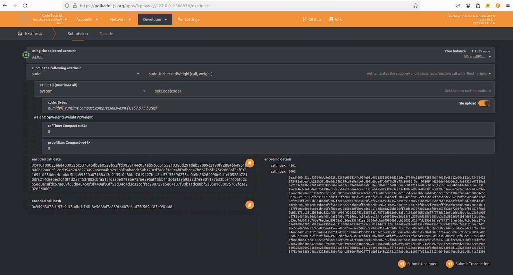
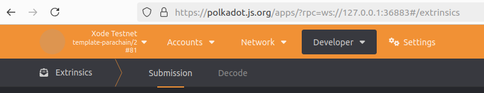

# Runtime Upgrade

## Runtime upgrade simulation using pallet-sudo

### 1) Download the XODE binary (x86_64)

```bash
curl -L "https://drive.usercontent.google.com/download?id=10zStcLL08V3hiCy507CBXMCKCb2VFQsM&confirm=xxx" -o xode-node
```

### 2) Run the node with Zombienet

```bash
./zombienet-launch.sh
```

Open a new terminal for building the new runtime.

### 3) Modify the runtime version

Edit `runtime/src/lib.rs` and bump only `spec_version`:

```rust
#[sp_version::runtime_version]
pub const VERSION: RuntimeVersion = RuntimeVersion {
    spec_name: create_runtime_str!("template-parachain"),
    impl_name: create_runtime_str!("template-parachain"),
    authoring_version: 1,
    spec_version: 2, // Modify only this
    impl_version: 0,
    apis: RUNTIME_API_VERSIONS,
    transaction_version: 1,
    state_version: 1,
};
```

### 4) Compile the runtime

```bash
cargo build --release --package xode-node
```

### 5) Locate the WASM artifact

```text
./target/release/wbuild/humidefi-runtime/humidefi_runtime.compact.compressed.wasm
```

### 6) Submit the upgrade with sudo

Open Polkadot-JS Apps (Zombienet Parachain endpoint), navigate to Sudo, and upload the new runtime WASM. Execute the sudo call to enact the upgrade.



### 7) Verify the new runtime version

Check that the reported version matches `template-parachain/2`.

---


## Runtime upgrade using pallet-democracy (OpenGov)

Follow your network's OpenGov process to submit and approve a runtime upgrade proposal, then fast-track/enact per governance rules. Steps mirror the sudo flow but initiated through governance extrinsics.


