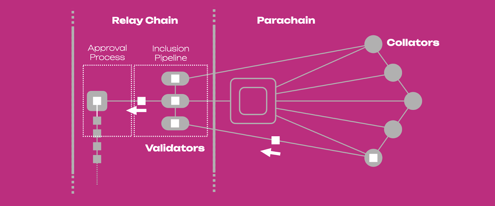

# XODE Network

**Created by**: Hgminerva  
**Last updated**: May 16, 2024 • ~3 min read

XODE Blockchain network comprises several essential components, each playing a distinct role in the functioning and interoperability of the blockchain within the broader Polkadot ecosystem.

## Key Components

### Parachain
At the core of the network is the parachain itself. This is an independent blockchain that connects to the Polkadot/Kusama Relay Chain through a designated parachain slot. Parachains have their own set of rules, consensus mechanisms, and governance structures tailored to their specific use cases and requirements.

### Parachain Slot
A parachain slot is a limited resource within the Polkadot/Kusama Relay Chain allocated to individual parachains. Securing a parachain slot allows the parachain to connect to the Relay Chain and participate in the Polkadot network. Slots are obtained through a decentralized auction mechanism, where parachain projects bid DOT/KSM tokens to secure a slot for a specified period.

### Polkadot/Kusama Relay Chain
The Relay Chain serves as the heart of the Polkadot network, facilitating communication and interoperability between parachains. It coordinates consensus among validators, manages the security of the network, and facilitates the transfer of messages and assets between parachains.

### Collators
Collators are responsible for producing block candidates on behalf of parachains. They collect transactions, execute state transitions, and package them into blocks that are subsequently submitted to validators for finalization. Collators play a crucial role in maintaining the operation and integrity of parachains.

### Validators
Validators are responsible for finalizing blocks on the Relay Chain and ensuring the security and consensus of the network. They participate in the block production and consensus process by proposing and validating blocks, staking DOT/KSM tokens as collateral, and participating in governance decisions.

### Message Passing Protocol
Parachains communicate with each other and the Relay Chain through a message passing protocol. This protocol enables the transfer of messages, assets, and data between parachains, allowing for interoperability and collaboration across the Polkadot network.

### Bridges
Bridges are connectors that facilitate communication between parachains and external blockchains or networks. They enable the transfer of assets and data between different blockchain ecosystems, expanding the reach and utility of parachains beyond the Polkadot network.

These components work together to create a dynamic and interoperable ecosystem within the Polkadot network, enabling parachains to collaborate, exchange assets, and access shared security while maintaining their autonomy and sovereignty.

### XODE Blockchain Collator Node and Relay Chain Validator Node

In XODE Blockchain within the Polkadot ecosystem, the relationship between collators and validators is crucial for the operation and security of the network. Below are the technical details of how these roles interact:

### Collator
- Responsible for producing block candidates on behalf of parachains.
- Collects transactions, executes state transitions, and packages them into blocks.
- Maintains a local copy of the parachain state and executes transactions according to the parachain’s rules.
- After assembling a block, broadcasts it to the network for validation.

### Validator
- Finalizes blocks on the Polkadot Relay Chain and ensures network security and consensus.
- Validates collator-produced blocks by verifying transactions and executing them against the current parachain state.
- Ensures blocks adhere to Polkadot consensus rules and parachain protocols.
- Participates in block production and consensus based on stake and reputation.

### Interaction Flow (High Level)
1. Collator gathers extrinsics, executes state transition, and produces a parachain block candidate.
2. Candidate, along with proofs/witness data, is submitted to the assigned validator group for availability and validity checks.
3. Validators verify correctness and availability, then include the candidate in a Relay Chain block if valid.
4. Once finalized by Relay Chain consensus, the parachain state transition attains finality.

> Note: The exact mechanics depend on the Polkadot release and parachain runtime, but the core responsibilities remain consistent.

