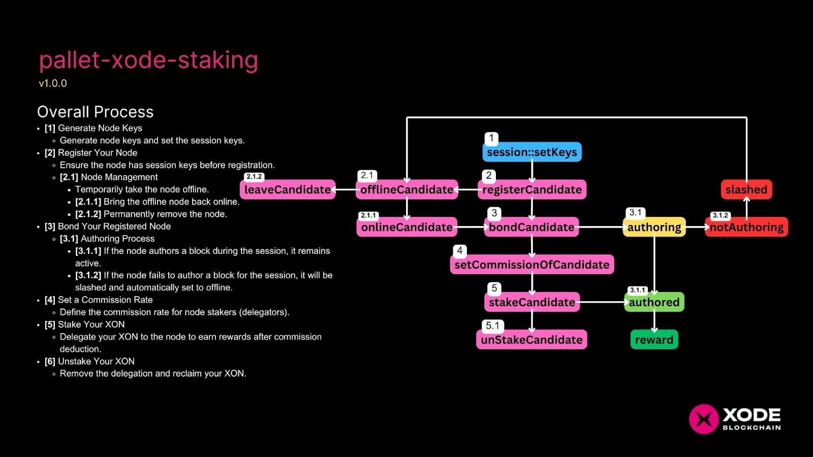
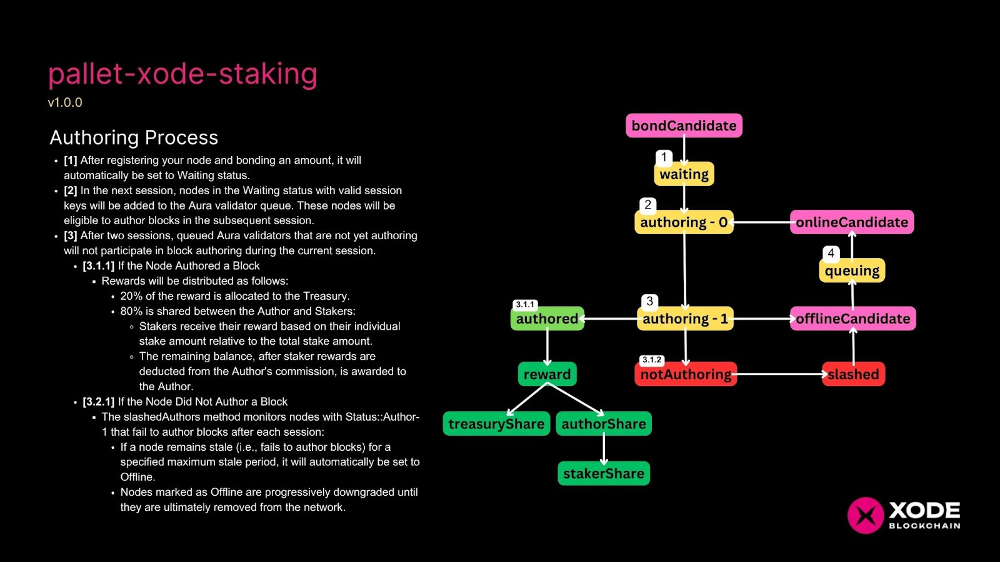
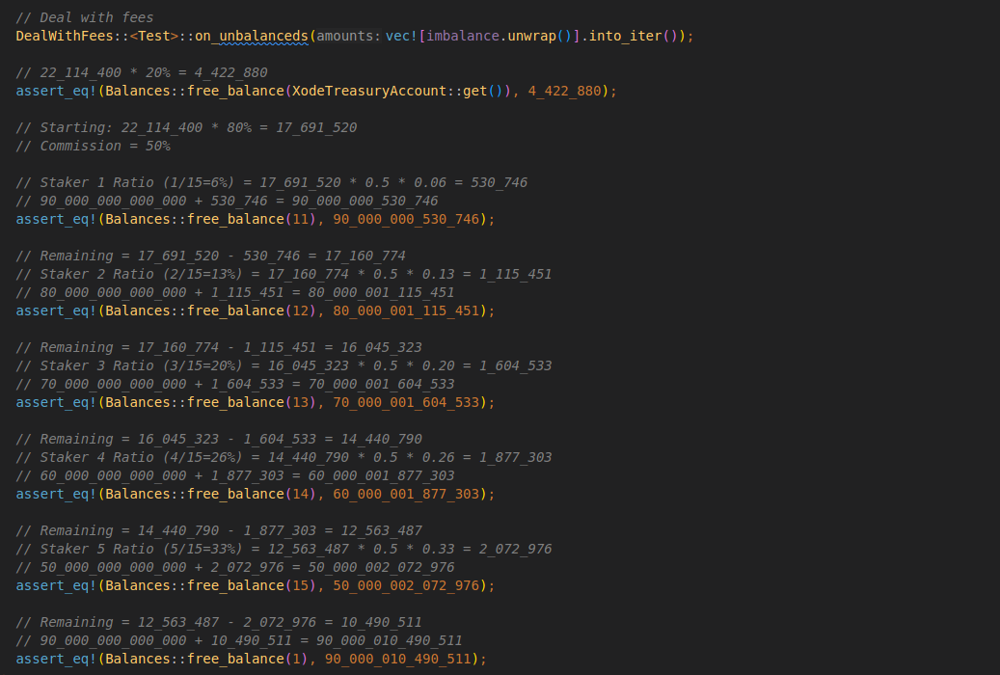
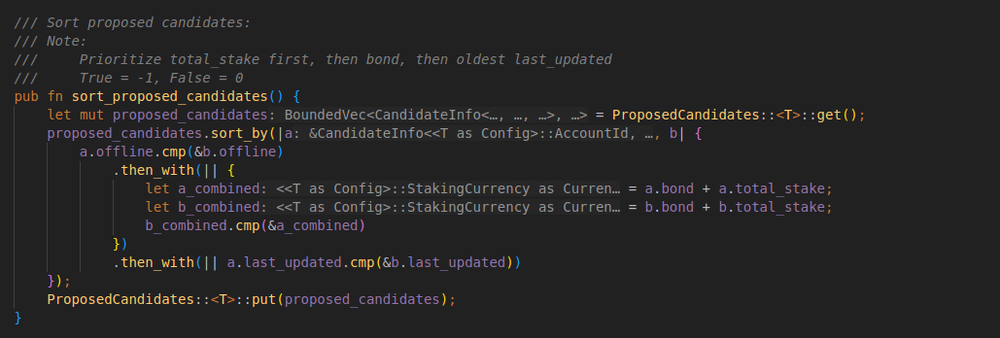

# XODE Staking and Consensus

Polkadot relies on a hybrid consensus model where block production and finality are separate. Parachains focus on producing blocks, while the Relay Chain validates state transitions and finalizes blocks.

As a parachain, XODE must answer two questions in a decentralized, trustless way:

1. Which nodes are allowed to author blocks?
2. If multiple nodes are allowed, which one may author a block at a particular time (only one author per slot)?

## Xode Consensus

Xode Consensus is a framework for slot-based collator selection on Cumulus-based parachains. It provides standard building blocks for the logistics of consensus engines and composable “filters” that developers can customize. These filters define eligibility for a block authorship slot and can be composed to restrict authorship in multiple steps.

XODE uses a two-layer filter approach:

- Staking: Select an active collator pool among all candidates using stake-based ranking.
- Allocating: Narrow the active pool to a per-slot subset of collators eligible to author.

Xode Consensus determines which collator(s) are eligible to produce the next parachain block. Cumulus marks the parachain block as best, while the Relay Chain’s BABE and GRANDPA finalize it. Once any Relay Chain forks resolve, the parachain block is deterministically finalized.

## Staking

Collators join the candidate pool by bonding XON via an extrinsic. XON holders may delegate to collators (staking) to increase their total backing.

XODE uses Nimbus to select the top 36 candidates by total XON staked (self-bond + delegations). This “selected candidates” set is renewed every round (1,200 blocks).

## Allocating (Slot Assignment)

XODE adopts the standard Aura (PoA) protocol from Polkadot to allocate block authoring responsibilities among the selected candidates. For each time slot, Aura deterministically picks the next collator in a round-robin sequence.

This provides fairness and predictability: each of the 36 collators gets equal opportunities to produce blocks, and only the assigned collator for a slot is authorized to author, minimizing conflicts.

## Invulnerable Candidates

Invulnerable candidates are pre-configured collator nodes essential for network operation, especially in early stages or testnets.

- Critical for network stability; pre-configured in XODE.
- Immune to slashing and protected from removal in defined scenarios.
- Automatically included in the active set (not subject to Nimbus selection).

### The Xaver Invulnerable Nodes

The Xaver node is an invulnerable node composed of light clients on specialized appliances. It remains online to sustain block production during disruptions, bypassing standard elections and avoiding slashing. This ensures continuity and resource-efficient participation while preserving decentralization goals.

## Staking Process

The process starts with generating node keys and setting session keys. After ensuring valid session keys, the node is registered for authorship and staking.

- Registered nodes can be taken offline, brought online, or removed.
- Nodes must be bonded to author. If a node authors during its session, it remains active; if not, it is slashed and set offline, reducing future eligibility.
- Operators may set a commission rate; delegators (stakers) share rewards proportionally after the author’s commission.
- Stakers can later unstake to reclaim tokens.

## Authoring Process

After registration and bonding, a node enters the Waiting status. In the next session, Waiting nodes with valid session keys join the Aura validator queue and become eligible to author in subsequent sessions. Queued validators that have not started authoring after two sessions may be skipped for that session.

When a node successfully authors a block, rewards are distributed:

- 20% to the Treasury
- 80% to the Author and Stakers

Stakers are rewarded by proportional stake after deducting the author’s commission. Nodes that fail to author are tracked by a slashedAuthors mechanism; prolonged inactivity leads to Offline status and eventual removal to preserve reliability.

## Sample Reward Computation

Example with total reward of 22,114,400:

- Treasury: 20% → 4,422,880
- Remaining (Author + Stakers): 80% → 17,691,520
- Author commission: 50% → 8,845,760 to Author after stakers’ share
- Stakers receive 8,845,760 proportionally by stake ratios (e.g., 6%, 13%, 20%, …)
- The Author’s final amount includes commission plus any undistributed remainder (e.g., 10,490,511 in the example).

## Sorting of Candidates

The `sort_proposed_candidates` routine orders candidates by:

1. Offline status (prefer not-offline)
2. Total backing (bond + stake)
3. Last updated timestamp (older preferred on ties)

This deterministic sequence ensures active, well-backed, and experienced candidates rank higher. The sorted list is written back to chain state.

---

See also: [XODE Network](./xode-network.md)

