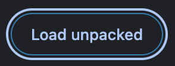

# Xterium Wallet

Xterium Wallet is a browser-based digital wallet designed to interact with the XODE Blockchain directly from your browser. It securely stores private keys and enables sending/receiving cryptocurrencies, managing tokens, and interacting with smart contracts.

## Chrome Web Store

Notice: We are currently awaiting Google approval for the Chrome Web Store. Please use manual installation for now.

## Manual Installation (Chrome)

1. Download the package (ZIP) for your preferred version:
   - Xterium v0.2.2 (Beta)
   - Xterium v0.2.0 (Beta)
   - Xterium v0.1.3 (Beta)
   - Xterium v0.1.2 (Beta)
   - Xterium v0.1.1 (Beta)
2. Extract the ZIP file into a directory (e.g., `chrome-mv3-prod`).

3. Open Chrome extensions: `chrome://extensions/`.

4. Toggle the Developer mode switch.

5. Click "Load unpacked" and select the `dist` directory inside the extracted folder.

6. The Xterium extension should now appear in Chrome. Pin it for quick access if desired.

## Using the Xterium Wallet

### First-time setup

- Create a password. Keep it safe—without it, you cannot recover your wallet data.
    
- Select the Xode network (Xterium supports multiple networks in the Polkadot ecosystem).

### Add or import wallets

- Open the sidebar menu and select "Wallets".

- Add a new wallet or import an existing wallet using seed phrase (mnemonic).
- When creating a wallet, provide a name and generate/provide a mnemonic phrase. The public address will be derived automatically.

Important: Back up your mnemonic phrase and never share it.

### Balances

After saving, you will land on the Balance tab to view account balances.

### Transferring

- From the Balance tab, click "Transfer".

- You can only transfer assets with available balance.
- Transfer a native asset (e.g., XON) first before sending non-native assets (e.g., IXON, XGM).
- Provide amount and recipient address, confirm the transfer.

- The wallet displays the estimated fee in XON.

Note: This is a Beta version—finality callbacks may be delayed. If balances don’t update immediately, wait a few seconds and refresh the Balance tab. Do not transfer non-native assets if the address has no XON.

### Adding or removing assets

- Go to the Assets tab.
- To remove an asset, click the trash icon.

- To add an asset, specify the type: Native, Asset (pallet-assets), or Contract (XON20/pallet-contracts). Ensure the network ID is correct. For Asset, provide the asset ID; for Contract, use the contract address.

## Old Xode Wallet Installer

### Android (APK)

Note: Manual APK installation required. Not available on Google Play.

- Xode Android Wallet APK (v0.1.1 Beta) — Latest
- Xode Android Wallet APK (v0.1.0 Beta)

### iOS App Store

`https://apps.apple.com/ee/app/xode-wallet/id6479734235`
